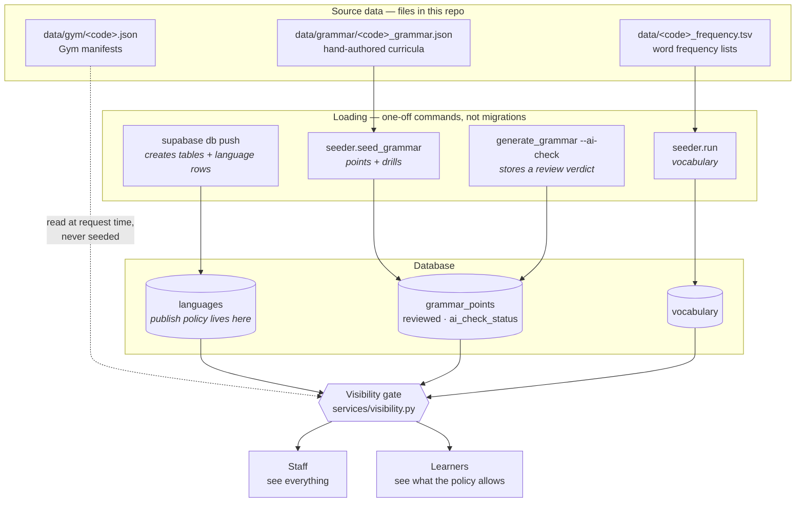
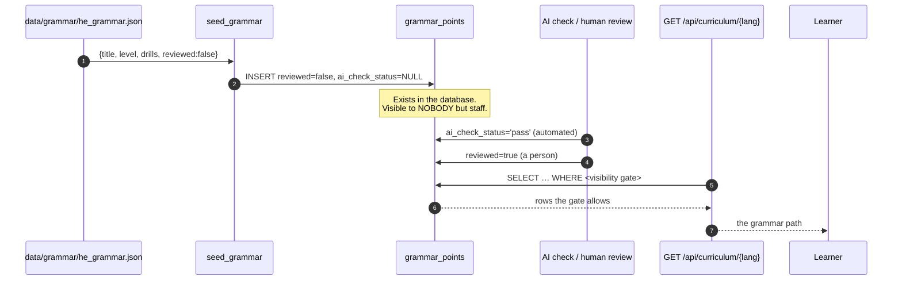
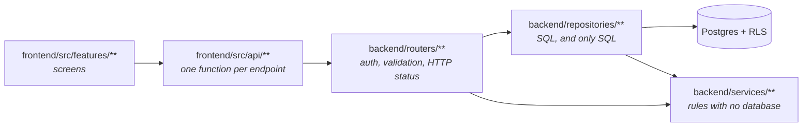

# PolyglotSRS — how it fits together

Start here. This is the map: what the moving parts are, how data gets from a
source file into a learner's screen, and where the decisions were made that
you would otherwise have to reverse-engineer from code.

Deeper documents live in `docs/`. This file links to them rather than
repeating them.

| If you want to… | Read |
|---|---|
| Understand who can see what, and why | [`docs/content-visibility.md`](docs/content-visibility.md) |
| Get a language's content into the database | [`docs/seeding.md`](docs/seeding.md) |
| Understand the review/approval flow | [`docs/review-workflow.md`](docs/review-workflow.md) |
| Understand roles and accounts | [`docs/accounts-and-roles.md`](docs/accounts-and-roles.md) |
| Run the AI content generators | [`docs/content-generation-cli.md`](docs/content-generation-cli.md) |
| Deploy | [`docs/DEPLOY.md`](docs/DEPLOY.md) |

---

## The shape of the system



**The one thing that surprises everybody:** loading content is three separate
commands, and `supabase db push` is only the first. A schema push creates the
*language*; it does not create its *content*. See
[`docs/seeding.md`](docs/seeding.md).

---

## Tracing one grammar point, source to screen

Follow a single point end to end. Every arrow is a place it can stop.



### Where it can silently stop

| Symptom | Cause | Check |
|---|---|---|
| Path is empty at every level | `seed_grammar` never ran | `SELECT count(*) FROM grammar_points WHERE language_id = …` |
| Rows exist, path still empty | Nothing satisfies the publish policy | the query in [`docs/content-visibility.md`](docs/content-visibility.md) |
| All vocabulary is A1 | Frequency list is a 90-word stub | `wc -l data/<code>_frequency.tsv` |
| A language is missing entirely | `is_visible = false`, or migration not applied | `SELECT code, is_visible FROM languages` |

---

## Layers, and what each is allowed to do



The rules that keep this honest:

- **Routers** check who you are and reject bad input. They do not contain SQL.
- **Repositories** contain SQL and nothing else. They take a connection and
  are agnostic about who called them.
- **Services** are pure logic — they can be unit-tested with no database and
  no network. `visibility.py`, `allowance.py` and `digest.py` are all this
  shape deliberately, so the rules they encode can be tested exhaustively.
- **Two connection kinds**: `rls_connection(user_id)` for anything acting as
  a user (Postgres row-level security enforces ownership), and
  `privileged_connection()` for staff operations — used *only* after the
  router has checked the caller's role.

---

## Decisions worth knowing about

These are the ones that look arbitrary until you know why.

### Content is gated by policy, not by a boolean

Two independent signals — a human approval and an automated check — with a
per-language setting deciding which combination reaches learners. Earlier
this was a hardcoded `reviewed OR (policy='ai_ok' AND ai_check='pass')`
copy-pasted into 21 queries, which is how a language could be switched to
"Open" and still show nothing with no explanation anywhere. Now one
definition in `services/visibility.py`.
→ [`docs/content-visibility.md`](docs/content-visibility.md)

### Unknown values fail closed

`normalize_policy` maps anything unrecognised to the *strictest* setting. A
typo, or a value written by a newer deploy, must never accidentally publish
unreviewed content. The only safe direction for a visibility bug is "too
little is visible".

### Missing migrations degrade, they don't crash

Endpoints that touch a new table or column catch `UndefinedTableError` /
`UndefinedColumnError` and return a degraded answer rather than a 500. This
came from a real outage: a deploy that shipped code before its migration took
the entire app down instead of losing one feature. The profile endpoint (hit
on every page load) and every feedback endpoint follow this pattern.
`/api/health/schema` reports exactly which migrations are missing.

### Learner progress survives re-seeding

Seeders UPSERT and diff-sync rather than delete-and-recreate, so drill IDs
stay stable and `user_cards` / `gym_progress` rows keep pointing at real
content. Re-running a seeder is always safe.

### Human-curated content is never overwritten

If a person has edited a point in the app, a re-seed sends the file's version
to the review queue instead of overwriting their work.

### Explicit content is opt-in, and the gate is one clause

The frequency lists come from subtitle corpora, which are honest about how
people speak — Spanish *puta* is rank 505, inside a beginner's first
thousand words. Rows carry `is_explicit` (on `vocabulary` and
`example_sentences`, backfilled from the English gloss's **primary sense
only**), and the learner's `allow_explicit_content` (off by default, toggled
in Settings → "Explicit words and sentences") decides what they see. A
setting, not a deletion: an adult who asks for these words is taught them.

The enforcement mirrors the visibility lesson above: one clause, defined
once in `repositories/explicit_gate.py`, used by *every* learner-facing
read — Learn selection, card examples, deck preview, deck listing, and
search. The first version gated only Learn, and the audit found what that
narrowness invites: a filtered learner couldn't be taught the word but
could open the A1 deck, or search for it, and read the gloss anyway. A gate
that only covers the front door is a claim, not a gate. Staff surfaces
deliberately bypass it — a reviewer deciding whether a flagged sentence
should exist has to be able to see it.

### The tutor has guardrails, and they ride in the system prompt

Every other surface ships reviewed content; the tutor ships whatever the
model says next, so its rules live where the conversation can't vote them
away. The charter (`services/tutor.py`) pins scope (a language tutor and
nothing else), refuses the translation loophole ("just translate this
threat" is still writing a threat), resists persona/instruction-override
requests, and drops the tutor persona entirely if a learner discloses
being in danger.

The explicit-content setting reaches the tutor too — the same flag the
curriculum gate reads, so a learner whose cards never show a slur isn't
taught one by the chat next to them. That per-learner line sits in the
**volatile** prompt block on purpose: the charter block is cached per
language, and folding a per-user flag into it would silently fork the
cache in two.

### Support-locale translations fill themselves — by demand, never by matrix

Content is authored against an **English spine** (every gloss, hint and
explanation gets one English rendering, eagerly). Other support locales are
**overlays**: per-locale rows that `COALESCE` over the English original, so
0% coverage is a working state, not an error. Pre-translating everything
into every locale would be millions of rows and an unpayable review debt —
so nothing is ever pre-seeded.

Instead, `services/auto_translate.py` runs an in-process sweep that spends
only where three predicates all hold: an admin switched the course on
(`languages.auto_translate_enabled`, default off, toggled in the
language-management panel), a **real account** uses the (course, support
locale) pair, and the word still lacks that locale's gloss. Work is ordered
the way a learner meets it (A1 before C2, frequent before rare), capped per
sweep (`auto_translate_words_per_cycle`), and goes through the same
maker–checker as the manual CLI: approved glosses land in `translations`,
rejected ones in `translation_reviews` for a human — never auto-applied.
English is the pivot for non-English courses (the maker renders the word's
English definition), which is what keeps the matrix linear instead of
quadratic. The loop runs under no user account and draws from **no
learner's usage allowance** — cost lands on the operator's API key, on the
cheap translate-task model. Without the toggle migration it treats every
course as off: the safe direction for this feature's degrade is "translate
nothing".

### The site's own language is a third locale concept — don't conflate them

Three separate things carry a language code: the **course** (what you're
learning), the **support locale** (what content is explained in —
`support_locale`, the overlay system above), and now the **UI language** —
what the chrome itself reads in (`frontend/src/i18n/`, persisted in
`user_profiles.ui_language`). Detection order: explicit device choice →
account's saved choice → the browser's preferred languages → English. The
browser signal, not IP geolocation, on purpose: IP answers "what country",
not "what language". The switcher is a globe listing each language's own
name for itself (never country flags — which flag is Arabic?); picking
Arabic flips the whole document to RTL. Catalogs are per-locale JSON under
`i18n/locales/` — translated surfaces grow file by file, and untranslated
strings simply stay English (i18next falls back per key).

### Anything AI-written is labelled as such

`source`, `explanation_source` and `level_source` record provenance, so
"where did this sentence come from?" is always answerable, and so the review
queues can prioritise machine-written content.

---

## Background work

Four loops run in-process from the app lifespan (`backend/main.py`). All
never raise and are cancelled on shutdown; the email pair is gated on
`email_reminders_enabled`, the translate loop on
`auto_translate_loop_enabled` plus its per-language admin switch:

| Loop | Every | Does |
|---|---|---|
| `reminder_loop` | 15 min | Daily "reviews are waiting" email, at the learner's chosen hour |
| `digest_loop` | 1 hour | Weekly review email, carrying that week's recommendations |
| `auto_translate_loop` | 15 min | Fills missing support-locale glosses for admin-enabled courses with live learners (see the decision above) |
| `_check_schema` | once, at boot | Logs loudly if migrations are behind the code |

Both email loops write their "last sent" stamp **only on an accepted
delivery**, so a mail outage retries rather than silently skipping someone.

---

## Testing

```bash
# Frontend
cd frontend && npx tsc --noEmit && npx vitest run

# Backend — unit only
.venv/bin/pytest backend/tests -q

# Backend — including integration (needs a throwaway Postgres)
INTEGRATION_DATABASE_URL=postgresql://… .venv/bin/pytest backend/tests -q
```

**Integration tests skip silently without `INTEGRATION_DATABASE_URL`.** A
green run that says "1400 passed, 95 skipped" has not tested any SQL. Set the
variable before trusting a result that involves a query.
