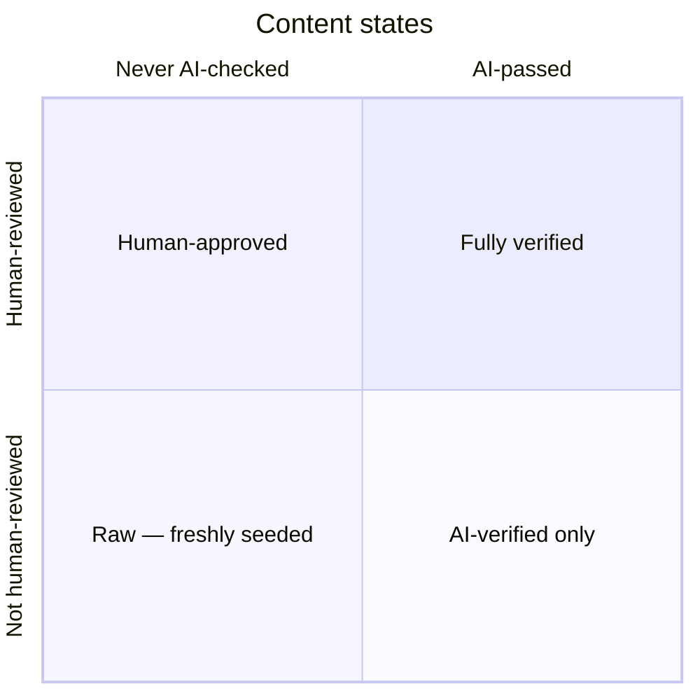
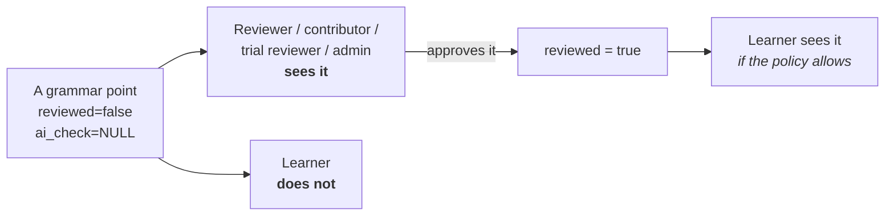

# Who can see what

Every question of the form "why can't learners see this?" or "why can my
reviewers see this but I can't?" is answered here.

One definition backs all of it: `backend/services/visibility.py`. Nothing
else in the codebase is allowed to decide this — it used to be copy-pasted
into 21 queries, which is exactly how the gate became both invisible and
unchangeable.

---

## The two signals

Content carries two **independent** review signals:

| Column | Meaning |
|---|---|
| `reviewed` | A person approved it |
| `ai_check_status` | `'pass'` / `'concerns'` / `NULL` (never checked) |

Independent, so there are six real states:



(`concerns` is a third value on the horizontal axis: AI-checked and *failed*.
It never counts as verified under any policy.)

Freshly seeded content is bottom-left: it exists, nothing has looked at it.

---

## The publish policy

A per-language setting, chosen by an admin in **Account → Admin → AI content
policy**. It decides which states reach **learners**.

| Policy | Learners see | Use when |
|---|---|---|
| `human_only` | `reviewed` | You have reviewers and want them to be the gate |
| `ai_ok` | `reviewed` **OR** AI-passed | You want automated verification to be enough |
| `both` | `reviewed` **AND** AI-passed | Belt and braces on a flagship language |
| `all` | everything, unchecked included | You're building the language out and want to see it |

`'strict'` is the stored legacy spelling of `human_only`. It is normalised on
read, never rewritten — renaming a stored value costs a table rewrite and
buys nothing, and `normalize_policy` maps *anything* unrecognised to the
strictest option so a legacy or typo'd value fails closed.

---

## Staff are not learners

This is the part that makes reviewers worth having:



Staff for a language see **every** point regardless of policy — a reviewer
cannot review what the gate hides from them. Implemented by
`staff_sees_all()` in `repositories/curriculum.py`, which lifts the gate for
anyone holding `admin`, `reviewer`, `contributor` or `trial_reviewer` on that
language (or globally).

It fails to `False` if the roles lookup errors: an error must never
*expose* unpublished content.

---

## Diagnosing "nothing is showing"

```sql
SELECT l.code, l.grammar_review_policy,
       count(*) FILTER (WHERE gp.reviewed)                        AS human,
       count(*) FILTER (WHERE gp.ai_check_status = 'pass')        AS ai_passed,
       count(*) FILTER (WHERE gp.reviewed
                          AND gp.ai_check_status = 'pass')        AS both,
       count(*) FILTER (WHERE NOT gp.reviewed
                          AND gp.ai_check_status IS NULL)         AS raw
FROM grammar_points gp
JOIN languages l ON l.id = gp.language_id
GROUP BY 1, 2 ORDER BY 1;
```

Read it against the policy:

- policy `human_only` and `human = 0` → nothing is published. Approve some, or
  loosen the policy.
- policy `ai_ok` and `ai_passed = 0` → **the common one after seeding.** The
  policy is only half the gate; no point carries a verdict yet.
- policy `both` and `both = 0` → needs both signals on the same row.
- policy `all` and still nothing → the content genuinely isn't there. Check
  `seed_grammar` ran ([`seeding.md`](seeding.md)).

The admin panel now surfaces this directly: when a policy needs a verdict and
points don't have one, it says how many are hidden and offers both fixes —
run the check, or switch policy.

---

## Getting a verdict onto content

**In the app** — Account → Admin → *Check all N now*. Batches through the
unchecked points, resumable, uses the server's API key.

**From the command line:**

```bash
python -m backend.services.seeder.generate_grammar --language he --ai-check
```

Only touches points with no verdict, so an interrupted run resumes instead of
re-billing. `--recheck-all` forces a redo. Needs `ANTHROPIC_API_KEY`, or
`TUTOR_DEV_MOCK=1` for a canned pass while wiring things up — which is
honest only if you then re-run it for real.

**Per point** — the *Run AI check* button in the Contribute editor.

---

## Where the gate is enforced

| File | Surface |
|---|---|
| `repositories/curriculum.py` | Grammar path, point detail, search, learn |
| `repositories/cards.py` | Review queue, decks, cram, card detail |
| `routers/gym.py` | Gym drills |

All of them use the same CASE expression over `grammar_review_policy`.
Content types with no per-row AI verdict of their own — example sentences,
generated drills, AI-estimated vocabulary levels — ask the simpler question
"does this language let AI content through at all?", which is true for
`ai_ok` and `all`.

Covered by `backend/tests/integration/test_publish_policy_integration.py`,
which asserts every policy level against a real database and proves a
reviewer sees a point their learner does not.
